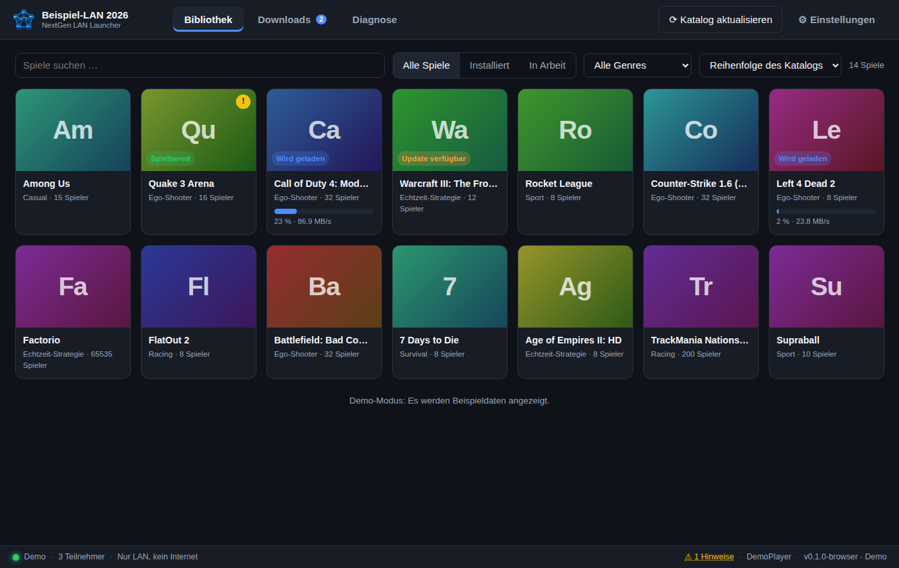

# NextGen LAN Launcher

A cross-platform alternative to the **ETI LAN Launcher** (eti-lan.xyz) for LAN parties: install and
start games from the existing ETI ecosystem (sync server, `game.db`, `.eti` packages, LANPage) on
**Windows 10/11, macOS and Linux**, with a modern interface that organisers can re-brand per
event and with clear instructions whenever something does not work.

> Status: **0.2.0 – build-out.** Core logic and UI are complete and tested; operation against a
> real sync server still has to be verified at the next LAN (see [Open items](#open-items)).



## What is different from the old launcher

| Problem at the last LAN | Solution here |
|---|---|
| Sync stuck at 99 %, "Install" never turns into "Play" | The launcher **verifies the archive itself** (CRC test) and extracts as soon as the file is complete on disk, regardless of what the sync engine reports. `crates/lanlauncher-core/src/install.rs` |
| "Too many workers" at startup | Exactly one sync engine instance, controlled by the launcher; orphaned processes are cleaned up at start. |
| Windows switches the LAN to a "Public" network profile | Diagnostics detects the profile and switches it to "Private" with one click; firewall rules apply to all profiles. |
| Unclear row of icons at the top | Labelled tabs: Library · Downloads · LAN · Diagnostics, plus Settings on the right. |
| Only one game folder | Several library folders (e.g. different SSDs); a new game goes to the default folder, or to the one with the most free space when the default is too small. |
| Windows only | Launch profiles (`manifests/*.toml`) plus Wine/CrossOver/Proton on macOS and Linux; Windows keeps running `game_start.cmd`. |
| Administrator rights for everything | The launcher runs as a normal user. UAC appears only for a game's one-time setup (which also registers the firewall rules its start script would add), for the few start scripts that write HKLM, for server scripts and for repairs. |

Design decision from our planning: every game has **one** primary button (Install / Downloading… /
Play / Update), but the secondary actions **Repair**, **Pause sync**, **Open folder** and **Remove**
stay visible at all times, whatever the launcher is currently doing. Repair stops the sync,
verifies the archive and re-extracts it.

## The Resilio API key

Resilio's documented Sync API (`/api?method=…`) needs an `api_key`; without one the launcher falls
back to the endpoints of Resilio's web interface, which are undocumented and differ between
builds. The key is the same for every client of a LAN, so it lives in one of three places, in this
order:

1. **Settings → Advanced → Resilio API key.** Saving it restarts the engine, no app restart needed.
2. **An installed ETI client:** `%ProgramFiles%\eti\LAN Launcher\sync\config.json`, line
   `"api_key"`. The launcher reads it by itself, nothing to type.
3. **The LANPage's `launcher.ini`**, so every PC at the LAN gets it without typing:

   ```ini
   [launcher]
   resilio_api_key = <the key>
   ```

The key is not in this repository. A PC without an ETI installation and without a LANPage
therefore needs step 1 once.

## Installing a build

CI and releases publish one artifact per operating system (`bundles-<os>` on the run page); the
installers sit at the top of the downloaded zip.

* **Windows:** `NextGen LAN Launcher_<version>_x64-setup.exe` (NSIS). The build is not signed, so
  SmartScreen shows "unknown publisher" — *More info → Run anyway*.
* **macOS:** the `.dmg`; the app is ad-hoc signed, so the first start goes through
  *System Settings → Privacy & Security → Open anyway*.
* **Linux:** three formats of the same build — `.AppImage` (runs anywhere, nothing to install),
  `.deb` (Debian/Ubuntu/Mint) and `.rpm` (Fedora/openSUSE). Take **one**.

### Steam Deck / SteamOS

SteamOS's system partition is read-only, so `.deb` and `.rpm` cannot be installed there; the
**AppImage** is the one to use. In desktop mode:

```bash
cd ~/Downloads
unzip bundles-ubuntu-22.04.zip -d nextgen      # Dolphin: right-click → Extract → Extract archive here
chmod +x nextgen/*.AppImage
./nextgen/NextGen\ LAN\ Launcher_*.AppImage
```

If the window opens with the right title but stays white, that is the webview, not the launcher:
WebKitGTK 2.42+ against several Linux drivers. **Leave it running** — the launcher works through
its renderer settings by itself, restarting once per setting until one draws, and remembers the one
that did. The window closes and reopens for each attempt; where the webview says outright that it
gave up, the next attempt follows within a second. Under two minutes in the worst case on the
first start of a machine that needs it, and nothing at all afterwards. If every setting comes up
white, a message box says so and names the file that holds what WebKitGTK said about it; send that
along. `--safe-graphics` skips straight to the last setting on the list, `--no-safe-graphics`
forgets the machine again. More levers in
[docs/TROUBLESHOOTING.md](docs/TROUBLESHOOTING.md#a-white-window-on-linux).

If Ark shows the zip but extracts nothing, `unzip` in Konsole does the job — GitHub's artifact zips
carry no folders, and Ark's "open" view is not an extraction. Should the AppImage complain about
FUSE, start it as `./nextgen/NextGen*.AppImage --appimage-extract-and-run`. For a permanent entry, move the
file somewhere stable (`~/Applications`) and add it to Steam via *Add a Non-Steam Game*; game
libraries belong on the SD card or an external SSD, set as the library folder in the launcher's
settings.

## Layout

```
crates/lanlauncher-core/   Rust library without GUI: catalog, launcher.ini, transport (Resilio/folder/demo),
                           install state machine, UnRAR, launching, diagnostics – 60+ tests
src-tauri/                 Tauri 2 app (commands, events, sidecar, demo mode)
src/                       Svelte 5 frontend (German/English, theme engine, browser mock for development)
manifests/                 Launch profiles for macOS/Linux (amongus, rocket, goldsrc, wc3, quake3, l4d2, flat2, cod2)
assets/covers/             Cover images bundled with the app (from eti-lan/LAN-Launcher, public domain)
themes/                    Example themes
tools/dev-lanpage/         Minimal LANPage stand-in for local testing (launcher.ini, launcher.css, stats.php)
docs/                      Architecture, compatibility, troubleshooting, theming, licensing
```

Details: [docs/ARCHITECTURE.md](docs/ARCHITECTURE.md) · [docs/COMPATIBILITY.md](docs/COMPATIBILITY.md) ·
[docs/TROUBLESHOOTING.md](docs/TROUBLESHOOTING.md) · [docs/THEMING.md](docs/THEMING.md) ·
[docs/LICENSING.md](docs/LICENSING.md) · [CLAUDE.md](CLAUDE.md) (operational notes for contributors)

## Development

Prerequisites: Rust (stable), Node 22, and on Linux
`libwebkit2gtk-4.1-dev libgtk-3-dev libayatana-appindicator3-dev librsvg2-dev`.

```bash
npm install
cargo test -p lanlauncher-core          # core logic
npm run check && npm test               # frontend
npm run dev                             # UI in the browser with a simulated backend (http://localhost:1420)
npm run tauri dev -- -- --demo          # the real app in demo mode (simulated sync)
npm run tauri build                     # installer for the current platform
node tools/dev-lanpage/server.mjs       # local LANPage stand-in on port 8080
```

In the browser, `http://localhost:1420/?wizard` shows the first-run wizard.

CI runs the Linux core tests and the frontend checks on every push. The full three-OS matrix and
the installer builds (artifacts `bundles-<os>` on the run page) only run for pull requests, pushes
to `main`, a manual run of the *CI* workflow, or a commit whose message contains `[full-ci]`.
Tags `v*` are built by `release.yml` instead.

## The app icon after an upgrade

Windows caches the icon of every path it has displayed. An upgrade writes a new executable to the
same path, so Explorer, the desktop shortcut and the taskbar can keep showing the icon of the
version before it, while the preview pane — which reads the file directly — already shows the new
one. The installer asks the shell to re-read it (`src-tauri/installer-hooks.nsh`, untested against a
real upgrade, see [Open items](#open-items)); where the cache is stubborn anyway, this clears it:

```bat
ie4uinit.exe -show
```

Failing that, close Explorer, delete `%LocalAppData%\Microsoft\Windows\Explorer\iconcache*.db`
and start it again, or simply reboot. A pinned taskbar entry keeps its own copy: unpin and pin it
again.

## Open items

- **Wayland libraries in the AppImage:** measured on a built image — `libEGL`, `libGL`, `libgbm`
  and `libdrm` are correctly left to the machine, but all four Wayland libraries are packed, and
  `libwayland-client.so.0` is on the AppImage exclude list (the one entry of the whole list that
  Tauri's own linuxdeploy build gets wrong). `tools/appimage-unbundle-wayland.mjs` takes all four
  back out and `ci.yml` runs it. **This was not what made the Steam Deck white** — that was settled
  on the device, see below — so it stands on the exclude list's own reasoning rather than on a
  symptom: a machine's Mesa and the Wayland libraries it links belong to the same machine. Verified
  here only that the files are in the image, that they are gone afterwards, and that the repacked
  image still starts and renders. `release.yml` runs it too since the build and the upload were split
  apart there (`tauri-action` builds, the script runs, `softprops/action-gh-release` uploads) — a
  manual run of that workflow now leaves the installers as a workflow artifact instead of making a
  release out of a branch name. The upload half has only been reasoned about; nothing here can push
  a tag to try it.
- **A white window on SteamOS — answered, by the device:** the launcher's own ladder found it. A
  Steam Deck (SteamOS, Wayland session, X11 window) draws on the `native` rung: **nothing forced at
  all**. `graphics.json` reads `{"good":"native"}` and the log line says `forced []`.
  That makes the cause plain, and it is an uncomfortable one: `WEBKIT_DISABLE_DMABUF_RENDERER=1`,
  shipped for four builds as *the* fix for a white GTK webview and forced unconditionally on every
  Linux machine, is what made this one white. The abort it produced, "Could not create default EGL
  display", is the call the path *without* the DMA-BUF renderer makes — so each later build stacked
  more settings on top of the actual cause, and `--safe-graphics` made things worse rather than
  better by adding yet more. Four rounds of guessing went into it; the ladder answered in seconds
  once it was on the device.
  That rung stays first for everyone else, because turning the DMA-BUF renderer off does fix the
  majority of white GTK webviews — but it is a guess now, not a law, and a machine it does not suit
  moves past it in about a second, because the launcher reads the abort out of the webview's own
  output.
- **Installer and a running launcher:** unsolved. The NSIS hook closes the launcher first and its
  sync engine second (the launcher restarts an engine it sees dying, and the installer's own
  "close the application?" prompt only comes after the hook), waits until nothing runs from the
  install folder, and now also stops whatever runs with this launcher's config on its command
  line — a Resilio that copied itself out of the install folder is ours wherever it sits. An
  upgrade on the LAN still reported the engine as running; what the installer says exactly is the
  next thing to find out, since none of this can be tried here.
- **The environment a game is started in:** what the launcher forces on itself to get its own
  window drawn (software rendering, an X11 backend, an EGL platform) is put back to the value it
  had before, and under an AppImage every path into the mount plus the image's own `GDK_BACKEND`
  and `GTK_THEME` are taken out of the child's environment. The rules are covered by tests; that a
  game actually starts better for it has only been reasoned, not run — there is no Linux game here
  to start. The sync engine is deliberately left as it is: it runs from the same AppImage and does
  so successfully on the Deck.
- **Icon after an upgrade:** the executable carries the right icon (the preview pane proves it),
  but the shell caches icons per path. The NSIS hook calling `SHChangeNotify` is meant to clear
  that on upgrade; whether it does for Explorer, the desktop shortcut and a pinned taskbar entry
  has not been verified against a real upgrade yet.
- **What `get_folders` means:** `size` counts the bytes of *finished* files, not what has
  arrived — a share whose single package is still transferring answers with the length of the
  `version.ini` beside it (eight bytes, a revision like `20250308`), which is what a 150 GB
  download showed for hours. Progress therefore comes from the `download` counters of
  `get_folder_peers`, `total_size` is the share's size and `down_speed` its rate. Read off a
  running 2.8.1 engine on the LAN. Those counters are cumulative for the engine's session, so
  only their increases are added up, and the display keeps the highest figure it reached: a
  restart of the engine costs the count of what arrived before it, not the bar. Restarting the
  *launcher* restarts the engine with it, and nothing on the disk can say how much of a
  half-transferred package is real (it was allocated at full size), so a resumed download counts
  up from the start again while transferring the remainder.
- **Firewall rules on a managed PC:** the rules are added with `netsh` from an elevated batch.
  Verified on a domain-joined Windows PC: the repair succeeds there, so the domain profile alone
  does not block it. A stricter policy still can, and then the failure carries the message `netsh`
  printed and the warning can be hidden.
- **Real Resilio operation:** the client speaks the documented Sync API (`/api`, with an API key)
  and falls back to the GUI endpoints. Both can only be verified against a running sync server.
  The install logic deliberately does not depend on either.
- **Bundled Resilio:** release builds and the full CI matrix ship the official binary pinned by
  version and SHA-256 in `resilio.lock.json`, currently build 2.8.1.1390 for all four platforms.
  Resilio 3.x requires a Resilio account for its free licence, 2.8.1 does not, the ETI sync
  server runs the same build, and the 3.x change logs list no fix that matters for LAN
  transfers; both versions sync with each other. Re-pin with the "Resilio lock" workflow (input
  `version`). The bundled copy is preferred over system installs and started in place; on
  Windows with `/noinstall /config …` (Resilio's download is the program itself). Untested on
  Windows hardware: that 2.8.1.1390 honours `/noinstall` and runs in place from the install
  folder instead of copying itself to `%APPDATA%`, that a bundled copy runs next to a user's own
  Resilio Sync, and launching scripts via `cmd.exe /S /C`.
- **Engine config:** the generated `config.json` mirrors the ETI launcher's file (same keys, own
  values). The earlier key set made Resilio 2.8.1 exit with code 1 on the test PC; whether the
  mirrored set starts it there is the next thing to test. The API key is discovered from an
  installed ETI client or the LANPage (`resilio_api_key`); the web-UI fallback without a key is
  untested against a real engine.
- **Engine start diagnostics:** when the sync engine exits before its API answers, the error names
  other processes running the same executable and, failing that, every other running sync engine
  with pid and path (a user's own Resilio Sync or the ETI launcher's engine may block ours if
  Resilio allows one instance per machine). Whether two copies of Resilio 2.8.1 can run side by
  side, and whether the process table exposes executable paths on Windows, is untested.
- **LANPage logo and stylesheet:** `logo.png` and `launcher.css` from `launcher.lan` are applied
  in automatic theme mode; verified against ETI's LANPage template only, not yet against a live
  page.
- **Setup scripts and the ETI helper tools:** when a game's `game_setup.cmd` fails, the launcher
  reads the script, resolves the `%…%` variables and names the programs it calls that are not on
  this PC — `unrar.exe` and `fnr.exe` from the original launcher's folder are the usual answer to
  Windows' bare "The system cannot find the path specified". The parsing is covered by tests; the
  message has not been seen on the machine it was written for yet.
- **Runtime package installer:** Settings offers ETI's `eti_launcher/bin/preqsetup.exe` (about
  3.3 GB, .NET 4.8, VC++, DirectX 11, PhysX) behind a confirmation like the ETI client; whether
  the installer needs arguments is unknown and untested on hardware.
- **Download sources:** the expanded download panel lists the peers of a share with their rates,
  derived from the counters of `get_folder_peers`. Whether that field is a counter or already a
  rate is not documented publicly; the first peer entry an engine reports is written to the log
  so the assumption can be checked at the LAN.
- **Firewall rule check:** diagnostics ask `Get-NetFirewallRule` for the launcher's own rule and
  offer the fix only for the bundled or downloaded engine; the PowerShell output format and the
  behaviour with a stopped firewall service are untested on hardware. The fix now deletes every
  existing rule for the engine before it adds its own, because a block rule from a declined
  Windows prompt outranks any allow rule; that a declined prompt is what leaves the engine
  without access, and that the deletion clears it, is a hypothesis to verify at the LAN.
- **On-demand elevation:** the manifest is `asInvoker`; setup scripts, firewall rules, HKLM
  scripts and repairs run through PowerShell `Start-Process -Verb RunAs`. The UAC flow, the exit
  code hand-over and scripts that need admin in places the detection does not see are untested
  on hardware. The elevated batch file is started directly (`Start-Process -FilePath <batch>`)
  instead of through `cmd.exe /c`, so the argument list needs no nested quoting; every helper
  process runs with a hidden window, so no console flashes up. Both are untested on hardware.
- **Stopping the engine:** on exit the launcher asks its Resilio instance to shut down, waits
  three seconds and kills the process afterwards; deleting a game retries the directory removal
  while the engine still holds handles on it. Untested on Windows hardware.
- **Keygen and server start:** the detail page offers `keygen.exe` (started from `local/` like
  ETI's setup scripts do) and `server_start.cmd` (same four-argument contract as
  `game_start.cmd`) when the package ships them. Both run through `cmd.exe`/Windows and are
  untested on hardware.
- **Windows network check:** the diagnostics now read `IPv4Connectivity`/`IPv6Connectivity` from
  `Get-NetConnectionProfile`, skip idle adapters and downgrade a public adapter next to a
  private/domain one to a warning. Written against a test system with a domain network plus an
  idle second NIC; untested at a LAN party where the only adapter has no internet.
- **Catalog share and server detection:** in managed mode the launcher adds the `eti_launcher`
  share itself and reports "sync server found" when that share has a peer. The built-in key
  (`BUILTIN_CATALOG_KEY` in `crates/lanlauncher-core/src/catalog.rs`) is the public read-only key
  from ETI's `sync_server.tar`; a LAN with its own catalog can override it in the settings.
  Registration and peer-based detection are untested against a real sync server. Resilio cannot
  tell a server from another client that already holds the catalog, so a second player with a
  complete `eti_launcher` also counts as "server found".
- **ETI installs and setup scripts:** existing installations are adopted by comparing the
  archive listing with `local/`, and `game_setup.cmd` now receives the four-argument contract
  through the raw command line. Both untested on Windows hardware, as is the broadened Resilio
  search (ETI `btsync.exe`, PATH, other profiles, registry).
- **Covers and videos:** the installer ships the covers from the public
  [eti-lan/LAN-Launcher](https://github.com/eti-lan/LAN-Launcher) repository (`assets/covers/`,
  refreshed with `tools/update-covers.sh`), so the library shows artwork without a sync server.
  Covers from the LAN's `eti_launcher/update/assets.eti` replace them; videos still come only
  from the share (`video/<id>.mp4`).
- **macOS/Linux launch profiles:** six games have curated profiles; every other game gets a profile
  derived from `game_start.cmd` (91 of 158 ETI scripts start exactly one executable) or the user
  picks the executable on first launch.
- Roadmap: LANPage inside the launcher, a LAN-Share file-sharing view, TS3/Discord integration.

## License

MIT – see [LICENSE](LICENSE) and [THIRD_PARTY_NOTICES.md](THIRD_PARTY_NOTICES.md).
